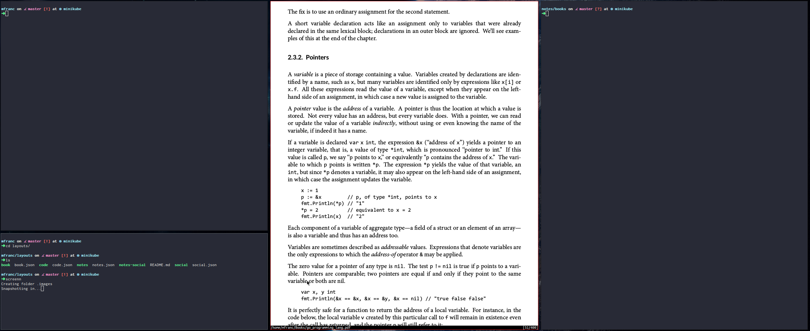
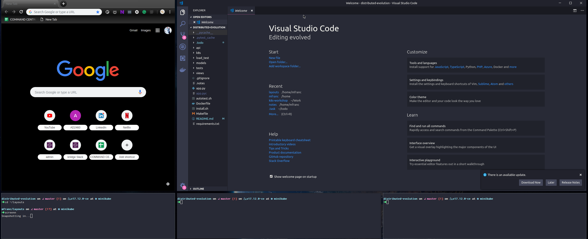
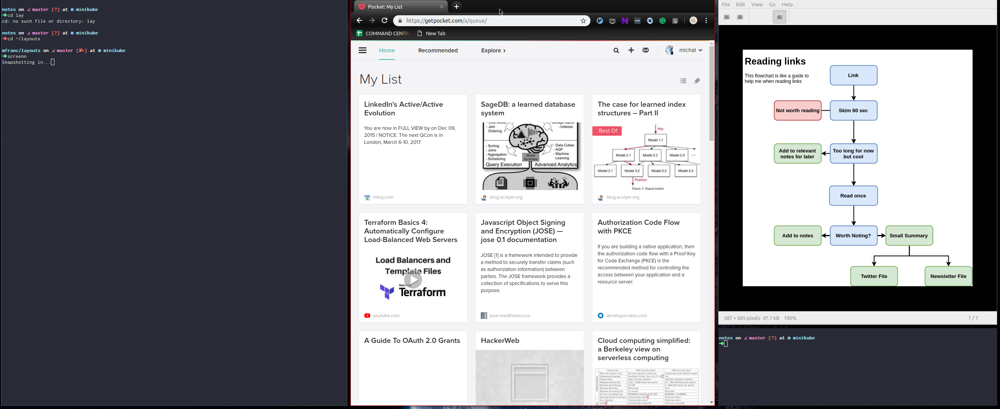

## Experimental layout system for i3

### Requirements
suod apt-get install libanyevent-i3-perl

### Using Layouts
There is a special script `layout` inside `/scripts` folder that lists all the layouts and enable you to use them.

Example:  
- opens layout `code` in workspace number 5 using `~/Work` folder as a param for layout.

### Layout list

#### Book
Example: `layout book`


- opens up 3 terminals and zathura app with PDF opened
- one termina insidel `notes/books` folder
- if you don't specify arguments it lets you choose the book by scanning `~/Books/` folder


#### Code
Example: `layout code ~/Work 5`

- opens up 3 terminals, `google chrome` and `vs code` with a folder pointing to the one provided in arg

#### Notes
Example: `layout notes pocket 6`

- opens up 1 termnal, `google chrome` with either `pocket, feedly or google keep` and a flowchart.

#### Social
- opens up `slack`, `google chrome` with social webpages and zoom in work context

### Creating new layout

Creeate your i3 windows as usuall. And then type:

```
i3-save-tree --workspace <workspace_nr> > <file>
```

This saves layout in `workspace nr` to a `file`. It is a json format. You need to modify this file uncommenting relevant `swallows` params. Don't worry this json file is not fully valid.

My system requires `json file` and corresponding `script` with the same name.

Example:
- code.json
    - layout definition
- code
    - script

The scripts are mostly doing two things:
- Loading layout
    - `i3-msg "workspace $workspace; append_layout /home/mfranc/layouts/code.json`
- starting up apps that are swallowed based on params

```
google-chrome --new-window &
termite -d $folder &
termite -d $folder &
termite -d $folder &
code $folder
```

Order of apps is important.
